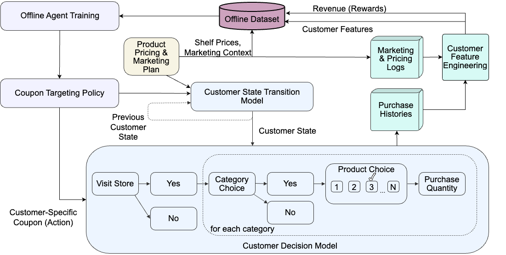

[](https://github.com/RetailMarketingAI/retailsynth-agentsim/blob/main/LICENSE)
[](https://github.com/psf/black)
[](https://pycqa.github.io/isort/)
[](https://arxiv.org/abs/2008.07146)


# RetailSynth-AgentSim: RL Agent Benchmarking for Personalized Retail Promotions

<details>
<summary><strong>Table of Contents</strong></summary>

- [RetailSynth-AgentSim: RL Agent Benchmarking for Personalized Retail Promotions](#retailsynth-agentsim-rl-agent-benchmarking-for-personalized-retail-promotions)
- [Overview](#overview)
  - [Simulation Environment](#simulation-environment)
  - [Reinforcement Learning Agents](#reinforcement-learning-agents)
- [Getting Started](#getting-started)
  - [Prerequisites](#prerequisites)
  - [Installation](#installation)
  - [Repository Structure](#repository-structure)
  - [Configuration](#configuration)
- [Usage](#usage)
- [Citation](#citation)
- [License](#license)
- [Support](#support)

</details>

# Overview
RetailSynth-AgentSim is a proof-of-concept platform for simulating the effect of AI agents on customer shopping behaviors. This platform benchmarks reinforcement learning (RL) agents to optimize coupon targeting, addressing the challenge posed by the sparsity of customer purchase events. We aim to inspire further development of simulation tools for retail AI systems, contributing to the advancement of AI in the retail industry. 

## Simulation Environment

RetailSynth-AgentSim includes a working simulation of optimizing coupon targeting using offline agents. The offline dataset contains customer features, purchase histories, marketing and pricing logs. Customer feature engineering transforms these data into descriptive feature indicators, informing the product pricing and marketing plan. This plan, alongside the customer state transition model, which captures previous customer states, feeds into the coupon targeting policy. This policy generates customer-specific coupon actions. The customer decision model then predicts customer behavior, determining store visits, category choices, product choices, and purchase quantities. 

<div align="center"></div>
<figcaption>
<p align="center">
    Data flow in RetailSynth environment for evaluating coupon-targeting agents
</p>
</figcaption>

We leverage the RetailSynth to build the customer decision model, which was carefully calibrated in precedent project [RetailSynth](https://github.com/RetailMarketingAI/retailsynth).

## Reinforcement Learning Agents

We implement a set of reinforcement learning agents using the TensorFlow Agents library. The agents are trained on the RetailSynth environment for coupon targeting policy on revenue optimization. We support linear contextual bandits (Linear Thompson Sampling (LinTS), Linear Upper Confidence Bound (LinUCB)); a neural contextual bandit (Neural Boltzmann (NB)); and deep reinforcement learning methods (Proximal Policy Optimization (PPO) and Deep Q-Network (DQN)). 

# Getting Started

## Prerequisites

This project assumes that you have Python 3.10.10 and poetry installed on your machine.

## Installation

You can install the project using `poetry` by running the following command:
```
git clone https://github.com/RetailMarketingAI/retailsynth-agentsim.git
cd retailsynth-agentsim
poetry install  # install deps
poetry shell    # switch to the project environment
```
## Repository Structure

This repository contains four major components:

- `src`: The main package containing the simulation environment, reinforcement learning agents, as well as utility module.
- `workflow`: Contains the e2e driver scripts for running the simulation and training the reinforcement learning agents.
- `tests`: Contains the unit tests securing function qualities.
- `examples`: Contains the quickstart notebook using a simplified retail scenario and the notebook to reproduce results from the paper.

Refer to the following directory structure for more details:

```
retail-agent-simulation
├── LICENSE
├── poetry.lock
├── pyproject.toml
├── workflow                                    # Research workflows
│ ├── main.py                                   # driver script to run every step in the train-eval workflow
│ ├── optuna_main.py                            # driver script to run hyperparameter optimization
│ ├── workflow_local.sh                         # shell script to run the workflow locally
│ └── workflow_aws.sh                           # shell script to run the workflow on AWS
├── src                           
│  └── retail_agent                             # Core RetailSynth library
│      ├── agents                               # Module for retail agents implemented in tf-agents
│      ├── envs                                 # Module for the retail simulation environment
│      └── utils                                # Misc utility functions
├── examples
│  ├── quickstart.ipynb                         # Quickstart notebook with a simplified example
|  └── paper_result_analysis.ipynb              # Result visualization for experiments reported on arXiv
└── tests 
```

## Configuration

We use hydra for configuration managements, and each component has its own configuration directory maintained in the folder `cfg`. With hydra, we can easily override the default configurations using the command line and manage the result directories dynamically. To override the default configurations, you can use the following command:

```
python workflow/main.py override_arg_name=override_value
```

Refer to the [Hydra Documentation](https://hydra.cc/docs/intro/) for more details.

# Usage


A formal quickstart example of a retail scenario, with limited number of products and customers, is available at [examples/quickstart.ipynb](./examples/quickstart.ipynb).


# Citation
Yu Xia, Sriram Narayanamoorthy, Zhengyuan Zhou, Joshua Mabry.<br>
**Simulation-Based Benchmarking of Reinforcement Learning Agents for Personalized Retail Promotions**<br>
[https://arxiv.org/abs/2405.10469](https://arxiv.org/abs/2405.10469)

Bibtex:
```
@misc{xia2024simulationbased,
    title={Simulation-Based Benchmarking of Reinforcement Learning Agents for Personalized Retail Promotions},
    author={Yu Xia and Sriram Narayanamoorthy and Zhengyuan Zhou and Joshua Mabry},
    year={2024},
    eprint={2405.10469},
    archivePrefix={arXiv},
    primaryClass={cs.AI}
}
```

# License
This project is licensed under the Apache 2.0 License - see the [LICENSE](LICENSE) file for details.

# Support
For support, questions, or feedback, please [file an issue](https://github.com/RetailMarketingAI/retailsynth-agentsim/issues) on our GitHub repository.
